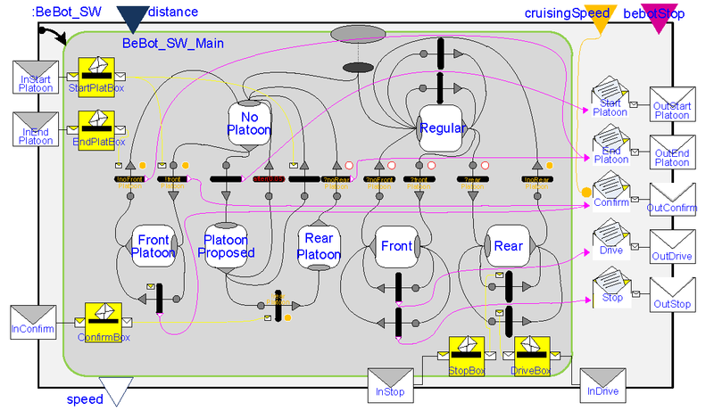

# RealTimeCoordinationLibrary

The `RealTimeCoordinationLibrary` contains an extension to the StateGraph2 library that enables modeling asynchronous and synchronous communication and rich real-time constraints for complex coordination protocols.

## Library description
We present a Modelica library for modeling communication under hard real-time constraints. Our library extends the Modelica_StateGraph2 library by providing support for (1) synchronous and asynchronous communication and (2) rich modeling of real-time behavior.

Adequate modeling constructs for synchronous as well as asynchronous communication and for real-time behavior are essential for modern embedded systems. Here, we consider synchronous and asynchronous communication to be a message-based communication where the former means that the sender always waits as long as the receiver is not able to consume the message. The latter means that the sender does not wait on a reaction of the receiver and proceeds with its execution that, in particular, might include sending further messages. For asynchronous communication, this implies that the receiver has to have a message buffer which is sufficiently large to prevent loss of messages.

For the modeling of synchronous communication, we extended transitions by synchronization ports (sync ports). Sync ports sub-divide into sender sync ports and receiver sync ports. A sender sync port of one transition is connected to a receiver sync port of another transition by a synchronization connector.

For the modeling of asynchronous communication, we introduce two new components named Message and Mailbox. Each instance of the Message component has two purposes. On the one hand, it defines a certain message type by specifying an array of formal parameters which might be of type Integer, Boolean or Real. As an example one message type might be defined by the array (Integer[2];Boolean[1];Real[1]). The parameter array of a message type is also called its signature. On the other hand, an instance of the Message component is responsible for sending a message whenever a connected transition fires. A transition is able to signal to a Message component instance to send a message if the firePort of the transition is connected to the condition- Port of the Message component instance.

For the modeling of real-time behavior according to timed automata, we extended the StateGraph2 library by three components named Clock, Invariant and Clock- Constraint. Clocks are real-valued variables whose values increase continuously and synchronously with time. Clocks might be reset to zero upon activation of a generalized step or firing of a transition. An invariant is an inequation that specifies an upper bound on a clock, e.g., `c < 2 or c <= 2` where c is a clock. Invariants are assigned to generalized steps and are used to specify a time span in which this generalized step is allowed to be active. A clock constraint might be any kind of inequation specifying a bound on a certain clock, e.g., `c > 2, c >= 5, c < 2, c <= 5` where c is a clock. Clock constraints are assigned to transitions in order to restrict the time span in which a transition is allowed to fire.

### Install Instructions
1. Copy the folder "`RealTimeCoordinationLibrary`" into the folder of your "`MODELICAPATH`" (e.g., `"C:\Program Files (x86)\Dymola 2013\Modelica\Library`")
2. Start Dymola
3. `File` &rarr; `Libraries` &rarr; `RealTimeCoordinationLibrary`

## Current release

Download [Latest development version](../../archive/master.zip)

#### Release notes
* [Version v1.0.2 (2013-04-04)](../../archive/v1.0.2.zip)
 * Added SelfTransition Class
 * Fixed SelfTransitions in Example/Application

* [Version v1.0.1 (2012-10-08)](../../archive/v1.0.1.zip)
 * Changed Transition Class
 * `firePort = fire` &rarr; `firePort = pre(fire)` *(Avoid algebraic loop when two outgoing transitions of a state send and receive a message)*

* [Version v1.0 (2012-05-21)](../../archive/v1.0.zip)
 * [Modelica library award (2nd prize) at the Modelica conference 2012](https://www.modelica.org/publications/newsletters/2012-3#item164) 
 * Initial version, uses Modelica Standard Library 3.2
   - First version of the real-time coordination library based on StateGraph2, Modelica.StateGraph and the prototype ModeGraph library from Martin Malmheden.

## License

This Modelica package is free software and the use is completely at your own risk;
it can be redistributed and/or modified under the terms of the [Modelica License 2](https://modelica.org/licenses/ModelicaLicense2).

## Development and contribution
 Main developer:
 > [Uwe Pohlmann](mailto:uwe.pohlmann@ipt.fraunhofer.de) 
 > Research Fellow 
 > Fraunhofer Institute for Production Technology IPT 
 > Project Group Mechatronic Systems Design 
 > Software Engineering 
 > Zukunftsmeile 1 
 > 33102 Paderborn 
 >
 > Phone: +49 5251 5465-174 
 > Fax: +49 5251 5465-102 
 > Room: 02-48
 
 Additional contributors:
  
  > [Stefan Dziwok] (mailto:xell@upb.de) 
  > Research Fellow 
  > Heinz Nixdorf Institute 
  > Software Engineering Group 
  > Zukunftsmeile 1 
  > 33102 Paderborn 
  
 Student assistants:
  > Boris Wolf 
  > Sebastian Thiele

You may report any issues with using the [Issues](../../issues) button.

Contributions in shape of [Pull Requests](../../pulls) are always welcome.

## Acknowledgments

This work was partially developed in the Leading-Edge Cluster
’Intelligent Technical Systems OstWestfalenLippe’ (it’s
OWL). The Leading-Edge Cluster is funded by the German
Federal Ministry of Education and Research (BMBF).

This work was partially developed in the project ‘ENTIME:
Entwurfstechnik Intelligente Mechatronik’ (Design Methods
for Intelligent Mechatronic Systems). The project ENTIME
is funded by the state of North Rhine-Westphalia (NRW),
Germany and the EUROPEAN UNION, European Regional
Development Fund, ‘Investing in your future’.
